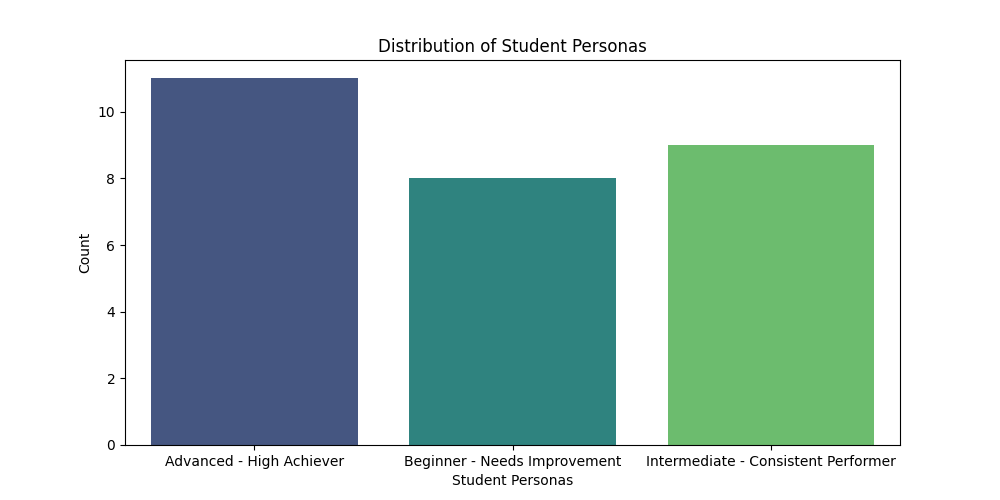
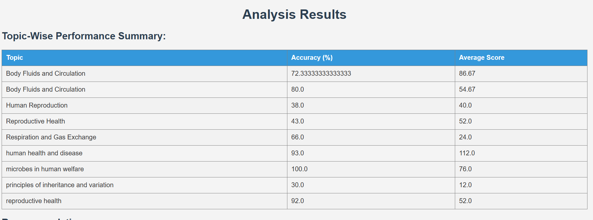
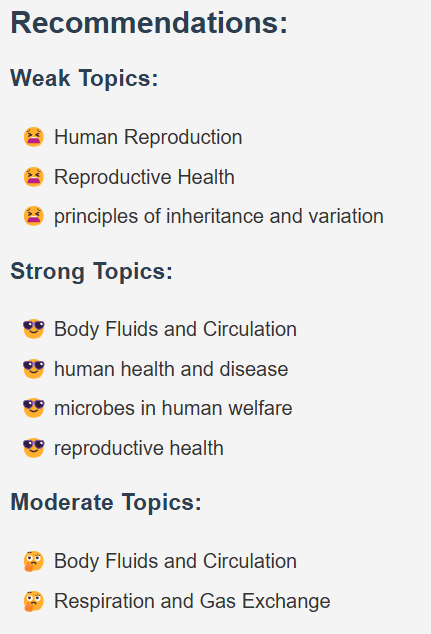

# Personalized Student Recommendations

## Overview
The **Personalized Student Recommendations** project is a ML Flask web application designed to analyze student quiz performance data. The application fetches data from a specified API, processes it to generate insights, and provides personalized recommendations to help students improve their preparation. It also clusters students into different personas based on their performance metrics. It uses Ml algo to genrate recommendations

## Features
- Fetches quiz performance data from an API.
- Analyzes performance by topic and generates insights.
- Provides actionable recommendations for students.
- Clusters students into personas based on quiz performance.
- Visualizes results using Matplotlib and Seaborn.

## Technologies Used
- Python
- Flask
- Pandas
- NumPy
- Requests
- Matplotlib
- Seaborn
- Scikit-learn

## Setup Instructions

### Prerequisites
Ensure you have Python 3.x installed on your machine. You can download it from [python.org](https://www.python.org/downloads/).

### Clone the Repository

<button onclick="navigator.clipboard.writeText('git clone https://github.com/Surajsingh-6/Personalized-Student-Recommendations.git cd Personalized-Student-Recommendations')
" style="position:absolute; right:10px; top:50%; transform:translateY(-50%); background:gray; border:none; color:white; padding:5px 10px; border-radius:3px; cursor:pointer">🗒️</button>
git clone https://github.com/Surajsingh-6/Personalized-Student-Recommendations.git
 
cd Personalized-Student-Recommendations

### Install Required Packages
You can easily install the required packages using the provided `requirements.txt` file:

<button onclick="navigator.clipboard.writeText('pip install -r requirements.txt')" style="position:absolute; right:10px; top:50%; transform:translateY(-50%); background:gray; border:none; color:white; padding:5px 10px; border-radius:3px; cursor:pointer">🗒️</button>
pip install -r requirements.txt

### Run the Application
To start the Flask application, run the following command:

<button onclick="navigator.clipboard.writeText('python app.py')" style="position:absolute; right:10px; top:50%; transform:translateY(-50%); background:gray; border:none; color:white; padding:5px 10px; border-radius:3px; cursor:pointer">🗒️</button>
python app.py

The application will be accessible in your web browser at `http://127.0.0.1:5000/`.

## Usage Instructions

1. Open your web browser and navigate to `http://127.0.0.1:5000/`.
2. Enter the API URL containing the quiz performance data.
3. Click on "Analyze" to view the results, including topic-wise performance, recommendations, and student persona summaries.

## Approach Description

The application follows these key steps:

1. **Data Fetching**: Retrieves quiz performance data from a specified API endpoint.
2. **Data Preparation**: Processes raw data into a structured format using Pandas DataFrames.
3. **Performance Analysis**: Analyzes student performance by topic, calculating average accuracy and scores.
4. **Insights Generation**: Generates insights on weak, strong, and moderate topics based on accuracy metrics.
5. **Recommendations**: Provides actionable recommendations for students to focus on areas needing improvement.
6. **Persona Clustering**: Clusters students into personas using K-Means clustering based on their performance metrics.
7. **Visualization**: Visualizes key results using Matplotlib and Seaborn for better understanding.

## Video Demo and Code Explaination

## Screenshots

Below are some key visualizations generated by the application:

*Figure 1: Topic-Wise Accuracy*

*Figure 2: Distribution of Student Personas*

### Figure 3: Topics Overview

*This visualization provides an overview of different topics covered in the quizzes along with their respective performance metrics.*

### Figure 4: Recommendations for Improvement

*This section highlights personalized recommendations for students based on their quiz performance, focusing on areas that need improvement.*

### Figure 5: Student Personas Summary

*This visualization summarizes the distribution of student personas based on their performance metrics, helping educators understand their student demographics better.*

# Python-based-Personalized-Student-Recommendation

